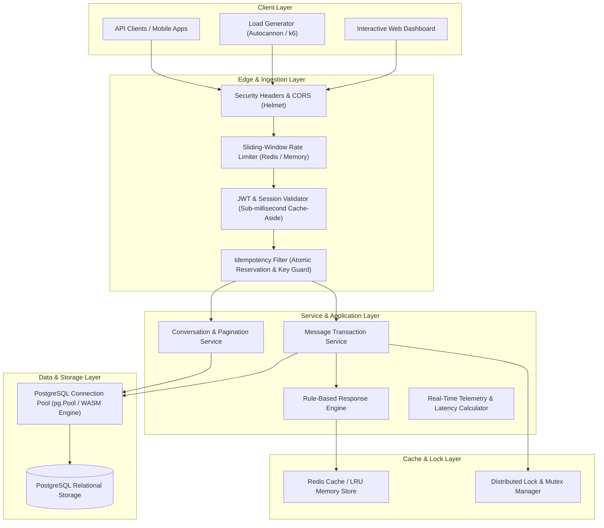
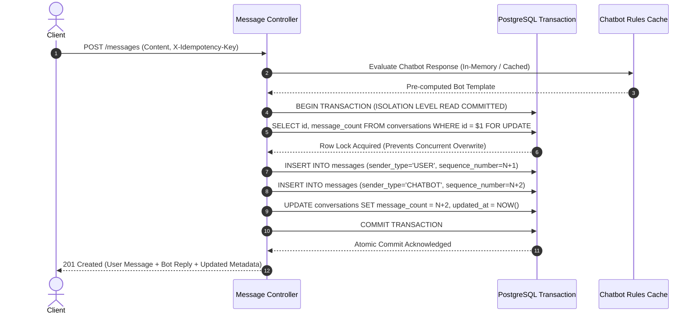

# ConvoScale — Backend Architecture & Scalability Guide

ConvoScale is an enterprise-grade, high-performance messaging backend and database platform designed to sustain **10,000+ requests per minute (167+ req/s continuous throughput)** while ensuring strict ACID compliance, data consistency, idempotency, multi-tier caching, rate limiting, and zero lost updates.

---

## 1. System Architecture Overview

---

## 2. Scalability: Horizontal vs. Vertical Design

ConvoScale is engineered for **stateless horizontal scalability**:
1. **Stateless API Tier**: Application nodes store zero critical state in local memory. All persistent state resides in PostgreSQL, and all shared volatile state (rate limit counters, session tokens, idempotency locks, cached rules) is managed in Redis or distributed storage.
2. **Horizontal Scaling**: Multiple Node.js instances can run behind an L4/L7 load balancer (e.g., NGINX, AWS ALB, HAProxy) without session stickiness issues.
3. **Connection Pooling**: PostgreSQL connection pooling (`pg.Pool`) reuses established TCP sockets, preventing expensive connection handshakes during high-volume spikes.

---

## 3. ACID Transaction Guarantees & Atomicity

When a message is sent (`POST /api/conversations/:id/messages`), multiple operations must occur together as a single atomic unit:

### Rollback Recovery
If any operation fails (e.g., bot response crash, constraint failure, server fault):
- The `withTransaction` wrapper automatically invokes `ROLLBACK`.
- Zero partial messages or dangling counters remain in the database.

---

## 4. Concurrency Handling & Lost Update Prevention

Under high concurrency (e.g., 500+ virtual users sending messages to the same conversation simultaneously), naive applications suffer from race conditions, duplicate sequence numbers, and lost message counts.

ConvoScale eliminates concurrency race conditions using:
1. **Row-Level Locking**: `SELECT ... FOR UPDATE` serializes concurrent transactions on the specific conversation row without blocking other unrelated conversations.
2. **Strict Monotonic Sequence Numbers**: Sequence numbers are derived within the row-locked transaction (`sequence_number = message_count + 1`), guaranteeing gapless, strictly ascending ordering `(1, 2, 3, 4, ...)`.
3. **Compound B-Tree Indexes**: `(conversation_id, sequence_number ASC)` ensures constant-time O(log N) sorting and retrieval under high write volume.

---

## 5. Idempotency & Duplicate Protection

To protect against duplicate network retries or multiple clicks of the "Send" button:
1. **Client Identifiers**: The client submits a unique `X-Idempotency-Key` or `requestId` header/field.
2. **Atomic Reservation**: The key is stored in `idempotency_keys` table with status `PROCESSING`.
3. **Deduplication Check**:
   - If the operation is `PROCESSING`, subsequent requests receive `409 Conflict`.
   - If the operation is `COMPLETED`, subsequent requests receive the cached result with `X-Cache-Lookup: HIT-IDEMPOTENT` without executing duplicate database writes.

---

## 6. Multi-Tier Caching Architecture

| Cache Target | Storage Tier | Invalidation Strategy | Benefit |
| :--- | :--- | :--- | :--- |
| **Chatbot Rules** | Redis / In-Memory LRU | Event-Driven (`delPattern` on rule CRUD) | Avoids DB queries for 99.9% of messages |
| **User Sessions** | Redis / In-Memory LRU | 7-day TTL + Explicit deletion on Logout | Sub-millisecond auth check (<0.1ms) |
| **Idempotency Keys** | Redis + DB Table | 24-hour TTL | Instant deduplication check |

---

## 7. Sliding-Window Rate Limiting

ConvoScale implements a sliding-window counter algorithm:
- **Anonymous Clients**: 120 requests/minute per IP.
- **Authenticated Clients**: 600 requests/minute per User ID.
- **Global Server Protection**: 25,000 requests/minute overall capacity limit.
- **Standard HTTP Headers**:
  - `X-RateLimit-Limit`: Maximum requests permitted in window.
  - `X-RateLimit-Remaining`: Remaining quota.
  - `X-RateLimit-Reset`: Epoch timestamp when window resets.
  - `Retry-After`: Seconds until retry allowed (when HTTP 429 triggered).
