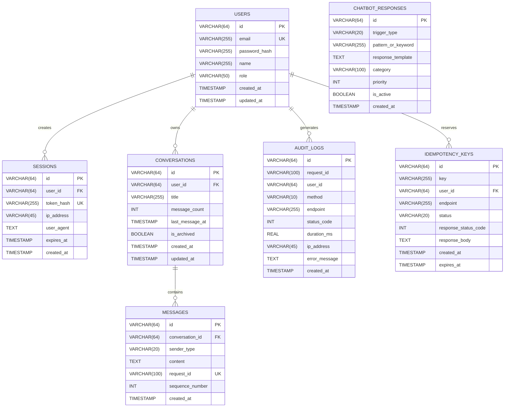

# ConvoScale — Database Architecture & Relational Design

The database schema of ConvoScale is designed in **Third Normal Form (3NF)** with strict referential integrity, optimized compound indexes, row-level locking support, and cursor-based pagination.

---

## 1. Entity-Relationship (ER) Diagram

---

## 2. Table Schemas & Constraints

### 1. `users`
- Stores registered users with bcrypt password hashing.
- Primary Key: `id (VARCHAR(64))`.
- Unique Index: `email (VARCHAR(255))` ensuring fast O(1) login lookup.

### 2. `sessions`
- Manages active JWT session tokens and token revocation.
- Foreign Key: `user_id` referencing `users(id)` with `ON DELETE CASCADE`.
- Unique Index: `token_hash (VARCHAR(255))` for token lookup.
- Index: `expires_at` for background session cleanup.

### 3. `conversations`
- Stores conversation metadata and real-time message counters.
- Foreign Key: `user_id` referencing `users(id)` with `ON DELETE CASCADE`.
- Compound Index: `idx_conversations_user_updated (user_id, updated_at DESC)` for high-speed conversation feeds.

### 4. `messages`
- Stores chronological chat messages and automated chatbot replies.
- Foreign Key: `conversation_id` referencing `conversations(id)` with `ON DELETE CASCADE`.
- Check Constraint: `sender_type IN ('USER', 'CHATBOT', 'SYSTEM')`.
- Compound Index: `idx_messages_conv_seq (conversation_id, sequence_number ASC)`.
- Index: `idx_messages_request_id (request_id)` for idempotency deduplication.

### 5. `chatbot_responses`
- Stores keyword, regex, exact, and command trigger rules.
- Compound Index: `idx_chatbot_active_priority (is_active, priority DESC)` ensuring prioritized evaluation.

### 6. `idempotency_keys`
- Stores client request tokens to prevent duplicate mutations.
- Unique Compound Constraint: `uq_idempotency_key_user (key, user_id)`.

### 7. `audit_logs`
- Non-blocking audit trail for request latency, endpoints, status codes, and errors.
- Index: `idx_audit_logs_created (created_at DESC)` for time-series analytics.

---

## 3. Database Indexing Analysis

| Index Name | Table | Columns | Type | Purpose |
| :--- | :--- | :--- | :--- | :--- |
| `idx_users_email` | `users` | `(email)` | B-Tree | Sub-millisecond user authentication lookup |
| `idx_sessions_token` | `sessions` | `(token_hash)` | B-Tree | Session authentication verification |
| `idx_conversations_user_updated` | `conversations` | `(user_id, updated_at DESC)` | B-Tree Compound | Ultra-fast sorted conversation feed pagination |
| `idx_messages_conv_seq` | `messages` | `(conversation_id, sequence_number ASC)` | B-Tree Compound | Chronological message history loading |
| `idx_messages_conv_created` | `messages` | `(conversation_id, created_at DESC)` | B-Tree Compound | Reverse chronological message querying |
| `idx_messages_request_id` | `messages` | `(request_id)` | B-Tree | Rapid duplicate message prevention lookup |
| `idx_chatbot_active_priority` | `chatbot_responses` | `(is_active, priority DESC)` | B-Tree Compound | Prioritized response rule matching |
| `idx_idempotency_lookup` | `idempotency_keys` | `(key, user_id)` | B-Tree Compound | Idempotent request deduplication |

---

## 4. Cursor-Based Pagination vs. Limit-Offset

ConvoScale implements **Cursor-Based Pagination** for high-volume message feeds:

### Limit-Offset Issues at Scale:
- `SELECT * FROM messages WHERE conversation_id = $1 ORDER BY sequence_number LIMIT 20 OFFSET 50000;`
- Forces the database engine to scan 50,020 rows, resulting in O(N) degradation as conversation depth grows.

### Cursor-Based Optimization:
- `SELECT * FROM messages WHERE conversation_id = $1 AND sequence_number > $2 ORDER BY sequence_number ASC LIMIT 20;`
- Utilizes the compound B-Tree index `(conversation_id, sequence_number)` to jump directly to the target record in **O(log N)** time, maintaining sub-millisecond query latency regardless of conversation size.
